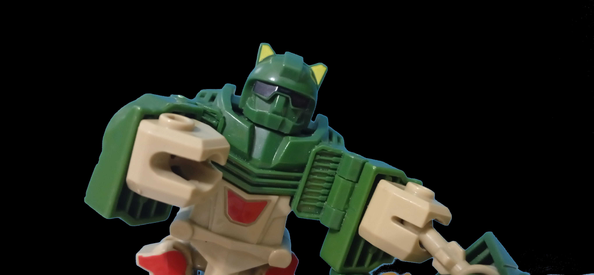
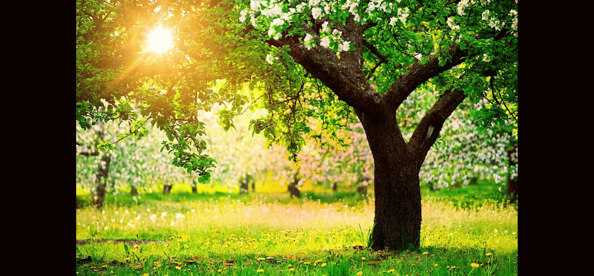
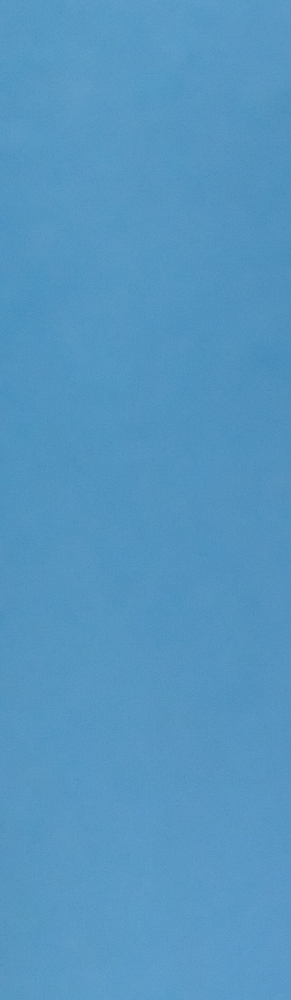
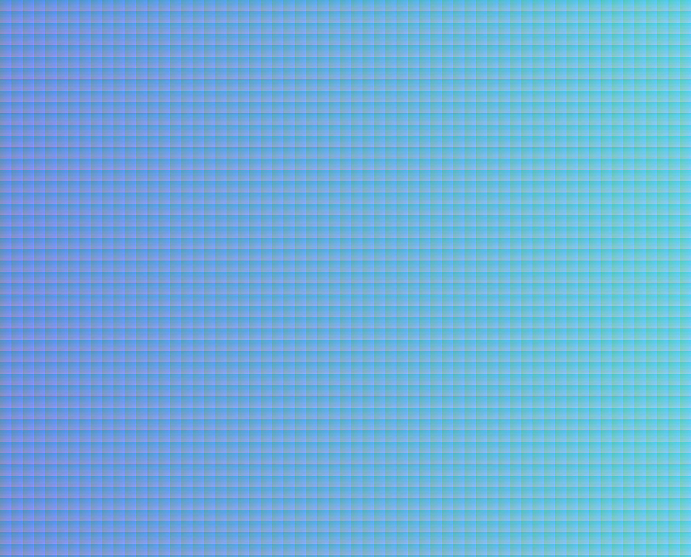

# Image Compositing and Matting

This project performs simple image compositing and artifact-based color correction using C++. It uses PNG input images to isolate and blend foreground and background regions, applying alpha matting logic for compositing.

## Example Output
*foreground*

-->

*alpha \* foreground*

-->

*background*

-->

*(1-alpha) \* background*

-->

*(1-alpha) \* background + alpha \* foreground*

## Features

- Load PNG images (foreground, background, artifact)
- Apply artifact-based color correction (RGB offset)
- Generate alpha matte from artifact image with    user specified tolerance
- Composite foreground over background using the matte
- Save the final blended image

*artifact Example (the wall behind the robot)*

*example map of tolerance = 30, if unspesified tolerance = 0*  

## Dependencies

- [stb_image.h](https://github.com/nothings/stb) and [stb_image_write.h](https://github.com/nothings/stb) for PNG loading/saving

## Project Structure

- `PngImage`: Struct to hold image data with width, height, channels, and raw pixel data
- `Compositing`: Main class that handles image loading, matting, color correction, and saving

## How to Use

1. Provide PNG images: artifact, foreground, and background.
2. Compile and run the program — it will generate a result image using the compositing process where you can save the image to enjoy it.

---

*Developed by Mohammed Yasser Mohammed* 

*email : es-mohamed.yasser2027@alexu.edu.eg* 

